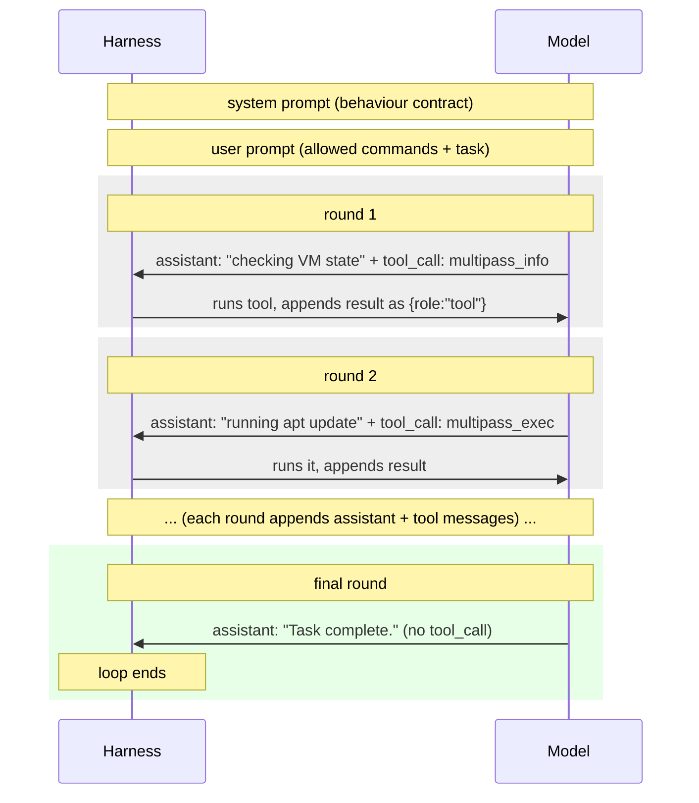

# Mph Tool Calling

`mph` has only two tool calls, and there are several reasons for this:
- less tool call specs = more space in context window.
- The agent doesn't manage the VM's lifecycle at all. The VM is guaranteed to be up and running by the time the agent needs to work, so the agent only ever inspects it and runs commands.
- Having explicit tool calls for VM lifecycle tend to confuse smaller models (i.e forgetting to check if a VM is running before executing commands) which results in extra computation, which is wasteful.

## The contract
| Tool | What the model must supply | What it returns |
|------|----------------------------|-----------------|
| `multipass_exec` | `command` (string) | combined stdout/stderr |
| `multipass_info` | n/a | a JSON payload describing the current VM state |

For `multipass_exec`, the `command` string can be several commands at once (such as `cat /proc/uptime | grep ...`), the input command is parsed into a shell AST and each command is validated against the allow list.

`multipass_info` takes no arguments. It returns a JSON payload with the current state of the VM (name, status, IP address, resources, and so on), which the model can read before or between `multipass_exec` calls. Because the harness guarantees the VM is already running, `multipass_info` is for *orientation*, for example, determining correct parameters for some command given the VM specs.

### How the tools are described to the model

The model needs a description of each tool's *shape*. `mph` builds an OpenAI-style JSON-schema document for each one: name, description, and parameters, and sends these as the `tools` field of the chat request (`buildToolDocuments` in `internal/agent`). For `multipass_exec` that document looks roughly like:

```json
{
  "type": "function",
  "function": {
    "name": "multipass_exec",
    "description": "Run a command inside the configured Multipass VM and return combined stdout/stderr...",
    "parameters": {
      "type": "object",
      "properties": {
        "command": { "type": "string" }
      },
      "required": ["command"]
    }
  }
}
```


`multipass_info` gets the same shape with no parameters at all (`"parameters": { "type": "object", "properties": {} }`), so the model can call it at any point for a fresh read of the VM state.


## The loop

Because model calls are stateless text generation, the harness keeps the whole state in the conversation:



The loop restarts only when the model emits a message **without** tool calls; that message is its final summary, and the harness stops and prints the collected command output.

## Forcing and forbidding tool calls

The `llm.tool_choice` setting controls nudging:

- `auto`: the model decides on its own.
- `required`: the model must emit a tool call every turn, so it cannot "finish" prematurely; useful when the model keeps talking instead of acting, or for one-off commands.
- `none`: tool calling is disabled; the model can only reply with text.

Two details keep the loop stable:

- **Length-limit recovery.** If the model's reply exhausts its token budget without a tool call, the harness appends a nudge ("be concise and run a tool call") and retries rather than dying.

## What the model sees when a tool runs

Tool results are returned to the model as JSON and are status-tagged so the model can react. `multipass_exec` returns the combined output:

```json
{ "status": "SUCCESS", "data": { "output": "<combined stdout/stderr>" } }
```

and `multipass_info` returns a JSON payload describing the current VM state:

```json
{ "status": "SUCCESS", "data": { "vm_state": { "name": "mph-vm", "status": "Running", "ip": "10.0.0.1" } } }
```

or, on a failure (including a denied command):

```json
{ "status": "FAILED", "data": { "error": "..." } }
```

The system prompt makes denial a hard stop: if a tool is denied, the agent must report and finish rather than try to work around the restriction. This is to prevent unintended behavior.

## Related

- [Configuring the LLM](../how-to/configure_llm.md)
- [Managing the VM lifecycle](../how-to/manage_vm_lifecycle.md)
- [Restricting commands](../how-to/restrict_commands.md)
- [Software architecture](../reference/arch.md)
