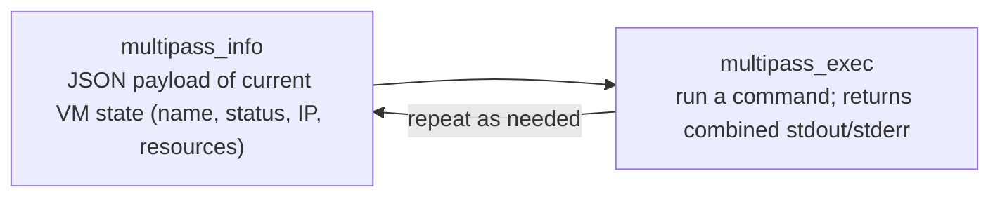

# Managing the VM lifecycle

The harness guarantees the VM is up and running by the time the agent needs to work. The agent doesn't manage the VM runtime, so the agent's only tools are `multipass_exec` and `multipass_info`.

## The cycle

The agent's only two tools cover the whole cycle:

- `multipass_info` returns a JSON payload describing the current VM state (name, status, IP, resources). Use it for orientation before or between commands.
- `multipass_exec` runs a command and returns its combined stdout/stderr.

Your prompt only needs to describe the task. There is nothing to write about creating, starting, stopping, or deleting the VM, because the agent cannot do any of those.

The harness will prompt for confirmation to continue if a VM with the same name already exists (unless you pass the `-i` flag to ignore and reuse it). 
If you don't pass the `-k` flag, the harness will delete the VM once the task has finished.

## Related

- [How tool calling works](../explaination/tool_calling.md)
- [Software architecture](../reference/arch.md)
- [Configuring the VM](configure_vm.md)
