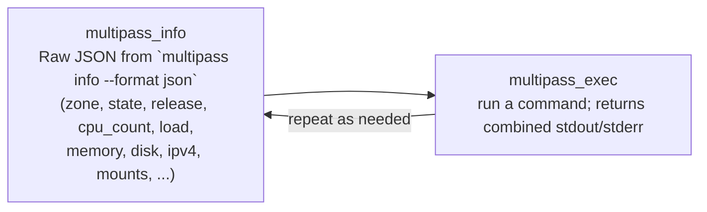

# Managing the VM lifecycle

The harness manages the VM lifecycle **outside** the agent loop. The agent's only tools are `multipass_exec` and `multipass_info` — it cannot create, start, stop, or delete the VM.

## Harness VM lifecycle

```mermaid
flowchart TD
    START([Start]) --> CHECK{VM exists?}
    CHECK -->|No| LAUNCH[Launch VM with configured spec]
    CHECK -->|Yes| PROMPT{User confirms<br/>reuse? (-i skips)}
    PROMPT -->|No| EXIT[Exit]
    PROMPT -->|Yes| AGENT
    LAUNCH --> AGENT[Run agent loop]
    AGENT --> DELETE{Keep VM? (-k flag)}
    DELETE -->|No| DEL[Delete VM]
    DELETE -->|Yes| KEEP[Keep VM]
    DEL --> END([Done])
    KEEP --> END
```

## The agent's tool cycle

Inside the agent loop, the two tools work together:



- `multipass_info` returns the raw JSON output from `multipass info --format json` for the configured VM. Use it for orientation before or between commands.
- `multipass_exec` runs a command and returns its combined stdout/stderr.

Your prompt only needs to describe the task. There is nothing to write about creating, starting, stopping, or deleting the VM, because the agent cannot do any of those.

The harness will prompt for confirmation to continue if a VM with the same name already exists (unless you pass the `-i` flag to ignore and reuse it). 
If you don't pass the `-k` flag, the harness will delete the VM once the task has finished.

- [How tool calling works](../explaination/tool_calling.md)
- [Software architecture](../reference/arch.md)
- [Configuring the VM](configure_vm.md)
