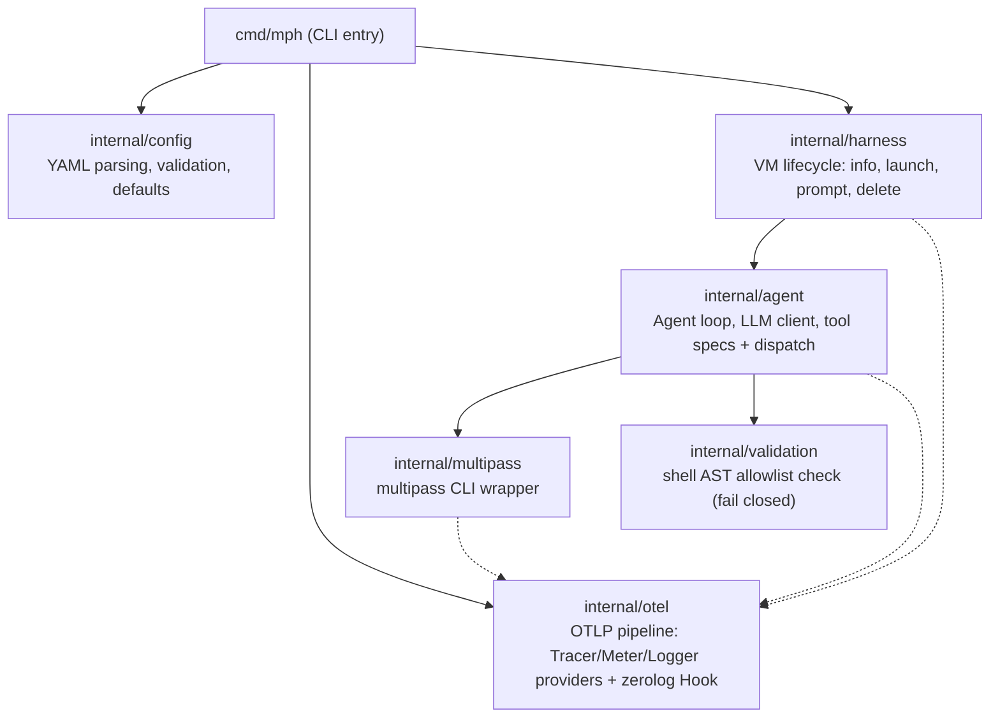
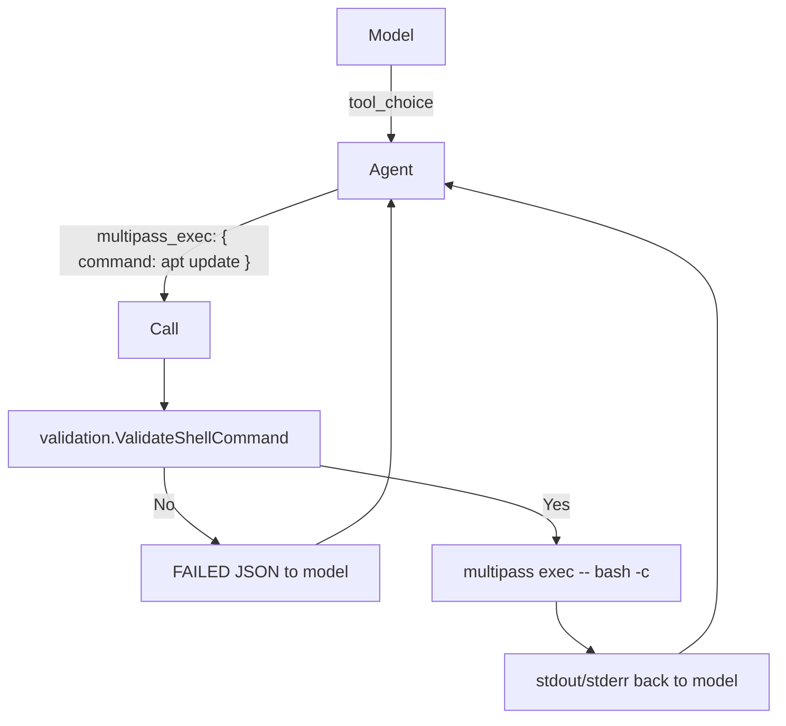

# Software architecture

This is the reference description of how MPHarness is structured and how it works internally. For hands-on usage, see the [tutorial](../tutorial/run_an_agent_with_task.md) and [how-to guides](../how-to/) instead.

## Purpose

MPHarness is a local harness for running agent-driven technical tasks inside a [Multipass](https://multipass.run/) VM. A small locally-run LLM acts as an autonomous agent that drives a Multipass VM through a *tool-calling* loop to complete a task described in a YAML config. Running the agent in a disposable VM keeps any damage it does contained.

## High-level layout

Tool dispatch (`Call`, `callExec`, `callInfo`) lives in `internal/agent/spec.go` alongside tool specifications.

## Package responsibilities

| Package | Responsibility |
|---------|----------------|
| `cmd/mph` | CLI entry point. Parses flags (`-i` to reuse existing VM, `-k` to keep VM after run, `--otel`/`MPH_OTEL` for tracing), configures zerolog logging, loads config, merges OTel precedence (flag/env > YAML > defaults), calls `otel.Setup`, installs the zerolog Hook, and runs the harness with a deferred `shutdown`. |
| `internal/config` | YAML config model, parsing, validation, and defaults. Owns the `allowed_commands` -> allowlist map, the `coreUtils` meta expansion, the optional `content_dir` (validated to be an existing dir, copied to `VMContentDir = "/home/ubuntu/content"`), and the optional `otel:` block (`enabled`, `endpoint`, `service_name`, `resource_attributes`) with defaults `localhost:4317`/`mph`. |
| `internal/otel` | Owns the OTLP pipeline. `Setup(Config)` creates gRPC exporters for traces/metrics/logs (`otlptracegrpc`/`otlpmetricgrpc`/`otlploggrpc`), builds `TracerProvider`/`MeterProvider`/`LoggerProvider` (`sdk/log`) with a `resource` (`service.name` + `OTEL_RESOURCE_ATTRIBUTES` + YAML `resource_attributes`), sets `otel.SetTracerProvider`/`SetMeterProvider`/`global.SetLoggerProvider`, and returns a `shutdown` that flushes. `Hook` bridges every zerolog event to OTLP logs (level 1:1, body = message, trace correlation via `e.GetCtx()`). Other packages use the OTel globals (`Tracer("mph")`, `Meter("mph")`) – cheap no-ops when disabled, so no constructor changes. |
| `internal/agent` | The agent loop, the LLM client, tool specifications, and the tool dispatcher. When enabled, each `Execute` iteration creates an `mph.agent.iteration` span (parent `mph.run` via the threaded `ctx`), emits `mph.agent.tool_call`/`tool_result`/`length_nudge` events, and records `mph.tokens`/`mph.iterations`/`mph.agent.tool.*` metrics. `InitializeModelFiles`/`NewKronk` optionally emit `mph.model.init`/`load`. System prompt is built via `buildSystemPrompt(cfg)` which appends a content notice when `content_dir` is set. |
| `internal/harness` | Orchestrates VM lifecycle: checks if VM exists, launches if needed, prompts to reuse existing VM (unless `-i`), copies `content_dir` to `VMContentDir` via `mkdir -p` + `Transfer` under child span `mph.vm.content` (if set), runs the agent with the root `mph.run` ctx, and deletes VM after task (unless `-k`). Creates root span `mph.run` (now includes `mph.content_dir`) and child `mph.vm.create`/`delete`/`content` spans around `Launch`/`Delete`/`Transfer` (which themselves create `multipass.*` children). |
| `internal/multipass` | A thin wrapper around the `multipass` CLI binary. Each method (`Info`/`Launch`/`Exec`/`Delete`/`Transfer`) creates a `multipass.*` span (`multipass.command`, `mph.vm.name`, `mph.command` truncated 4000, `multipass.args`). `Transfer` wraps `multipass transfer --recursive --parents`. |
| `internal/validation` | Parses a shell command into an AST (via `mvdan.cc/sh/syntax`) and checks every executed command against the allowlist; fails closed on anything it cannot verify. |

## Runtime flow

1. **Config load.** `config.LoadFile` reads the YAML, applies defaults (VM name `mph-vm`, `tool_choice: auto`, `max_iterations: 10`, `chat_timeout: 300s`, `total_timeout: 30m`, `otel.endpoint: localhost:4317`, `otel.service_name: mph`) and validates required fields (`vm.disk`, `vm.ram`, `vm.cpu > 0`, `model`, `prompt`). `content_dir` when set must be an existing local directory. OTel `enabled` defaults to `false`.

2. **OTel setup (if enabled).** `cmd/mph` merges `--otel`/`MPH_OTEL` > `OTEL_EXPORTER_OTLP_ENDPOINT`/`OTEL_SERVICE_NAME` > YAML `otel:` > defaults, calls `otel.Setup` (OTLP/gRPC exporters + `TracerProvider`/`MeterProvider`/`LoggerProvider` + `resource`), and installs the zerolog `Hook` on `log.Logger` so every later `log` line is also exported with `trace_id`/`span_id` when inside a span (`zerologAdapter` uses `logger.Info().Ctx(ctx)`).

3. **Model initialisation.** `InitializeModelFiles` (span `mph.model.init`, `mph.model`) detects/downloads the native llama.cpp libraries, initialises the kronk runtime, and downloads the model identified by `cfg.Model`. `NewKronk` (span `mph.model.load`, `mph.context_window`=`"auto"` when `0`) loads the model into memory (with optional `context_window`; `0` means auto-tune).

4. **Agent construction.** `NewAgent` bundles the logger, the kronk client (see `Kronk` interface below), iteration/timeout bounds, and sampling config.

5. **VM lifecycle & agent loop.** `harness.Start` starts root span `mph.run` (`mph.vm.name`, `mph.model`, truncated `mph.prompt`, `mph.keep`, `mph.ignore_existing`, `mph.allowed_commands`, `mph.content_dir`):
   - Calls `multipass info` to check if the named VM exists.
   - If not found: launches the VM with the configured spec.
   - If found and `-i` not passed: prompts the user to continue with the existing VM.
   - If `content_dir` is set: `mkdir -p /home/ubuntu/content` then `multipass transfer --recursive --parents` under `mph.vm.content` child span (with its own `multipass.transfer` child) before the agent starts.
   - Runs `Agent.Execute` with the multipass client.
   - On completion, deletes the VM unless `-k` was passed.

6. **Agent loop.** `Agent.Execute(ctx, ...)` derives the total-timeout ctx from the parent `mph.run` ctx, then per iteration starts `mph.agent.iteration` (`mph.iteration`, `mph.finish_reason`, token counts) and records `mph.tokens`/`mph.tokens_per_second`/`mph.iterations` plus `mph.agent.tool.*` events/metrics:
   - Builds the system prompt via `buildSystemPrompt(cfg)` (fixed contract + optional content notice for `/home/ubuntu/content`) and user prompt (allowed-commands line + task).
   - Builds tool documents from `Specs()` so the model knows the two tools: `multipass_exec` and `multipass_info`.
   - Repeats, up to `max_iterations` times: send messages + tools to the LLM, extract the assistant message, and either
     - **terminate** when the model replies with no tool calls (its final summary), or
     - **execute** the tool calls, append their results to the conversation, and continue.
   - Independent tool calls are batched into one turn (`parallel_tool_calls: true`, and the "Batching Work" section of the system prompt); dependent ones are chained with `&&` inside a single `multipass_exec`. Note that kronk parses `parallel_tool_calls` but does not forward it to the inference backend, so the prompt is what actually drives batching — the flag is kept accurate so the request does not contradict the prompt.
   - `max_tokens` caps one model turn (`llm.max_output_tokens`, default 2048) so a runaway completion cannot decode until it exhausts the context window and trip the length nudge.
   - Tool results handed to the model are capped at `agent.max_output_bytes`, or, when that is 0, at roughly 1/8 of the context window the model actually loaded (clamped to 2 KiB–64 KiB). The cap is fixed when the result is created and keeps both head and tail. It is never revised afterwards: kronk's incremental cache only reuses a complete token prefix, so rewriting an earlier message forces a full re-prefill.
   - Injection note: if the model hits the length limit with no tool call, a "be concise" nudge is appended and the loop continues.

7. **Tool dispatch.** `Call` in the `agent` package maps tool names to multipass operations. `multipass_exec` first passes the command through `validation.ValidateShellCommand`, so a command outside the allowlist never reaches Multipass. Each `multipass.*` call creates a `multipass.exec`/`info`/`launch`/`delete` child span and `Call` emits `mph.agent.tool_call`/`tool_result` events on the active iteration span.

8. **Result plumbing.** Tool results are surfaced to the model as JSON (`{"status":"SUCCESS","data":{...}}` or `{"status":"FAILED",...}`) attached to the `tool` role. The combined output of every executed command is collected and printed to stdout at the end, `---`-separated, when the loop finishes.

9. **Teardown.** The kronk runtime is unloaded and the OTel `shutdown` flushes the batch processors for traces/metrics/logs before exit (deferred in `main`).

## Data flow detail (single `multipass_exec`)

