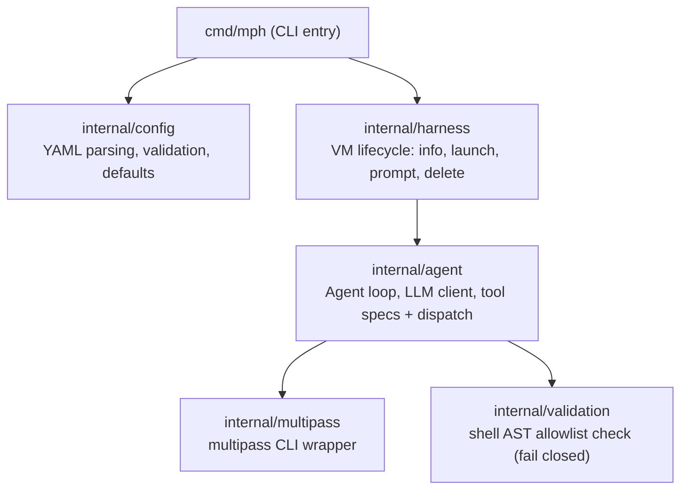
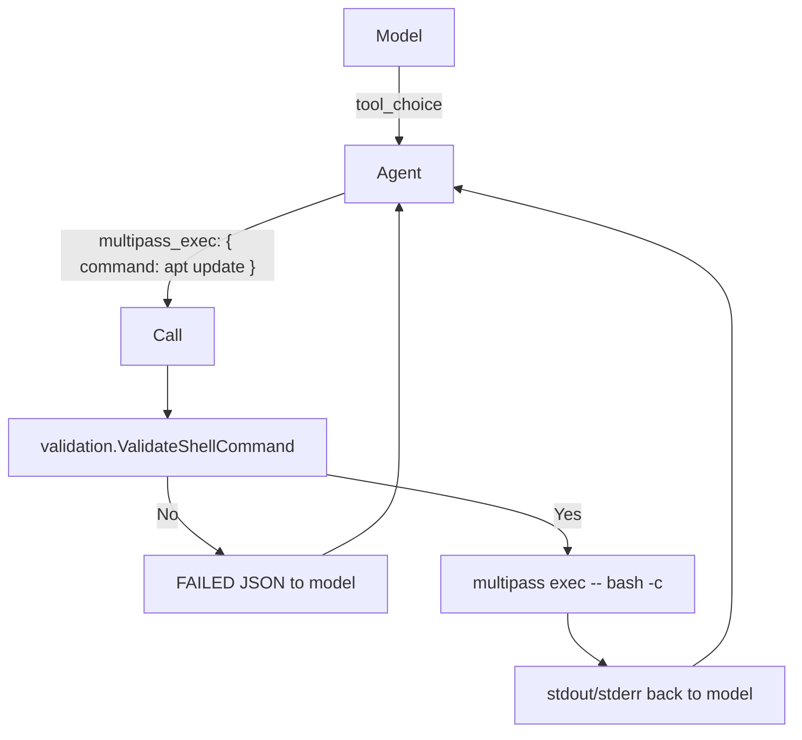

# Software architecture

This is the reference description of how MPHarness is structured and how it works internally. For hands-on usage, see the [tutorial](../tutorial/run_an_agent_with_task.md) and [how-to guides](../how-to/) instead.

## Purpose

MPHarness is a local harness for running agent-driven technical tasks inside a [Multipass](https://multipass.run/) VM. A small locally-run LLM acts as an autonomous agent that drives a Multipass VM through a *tool-calling* loop to complete a task described in a YAML config. Running the agent in a disposable VM keeps any damage it does contained.

## High-level layout

Tool dispatch (`Call`, `callExec`, `callInfo`) lives in `internal/agent/spec.go` alongside tool specifications.

## Package responsibilities

| Package | Responsibility |
|---------|----------------|
| `cmd/mph` | CLI entry point. Parses flags (`-i` to reuse existing VM, `-k` to keep VM after run), configures zerolog logging, loads config, initialises the LLM, builds the agent, and runs it. |
| `internal/config` | YAML config model, parsing, validation, and defaults. Owns the `allowed_commands` -> allowlist map and the `coreUtils` meta expansion. |
| `internal/agent` | The agent loop, the LLM client, tool specifications, and the tool dispatcher. |
| `internal/harness` | Orchestrates VM lifecycle: checks if VM exists, launches if needed, prompts to reuse existing VM (unless `-i`), runs the agent, and deletes VM after task (unless `-k`). |
| `internal/multipass` | A thin wrapper around the `multipass` CLI binary. The agent's tools need `info` and `exec`; the harness uses the wrapper to keep the VM running. |
| `internal/validation` | Parses a shell command into an AST (via `mvdan.cc/sh/syntax`) and checks every executed command against the allowlist; fails closed on anything it cannot verify. |

## Runtime flow

1. **Config load.** `config.LoadFile` reads the YAML, applies defaults (VM name `mph-vm`, `tool_choice: auto`, `max_iterations: 10`, `chat_timeout: 300s`, `total_timeout: 30m`) and validates required fields (`vm.disk`, `vm.ram`, `vm.cpu > 0`, `model`, `prompt`).

2. **Model initialisation.** `InitializeModelFiles` detects/downloads the native llama.cpp libraries, initialises the kronk runtime, and downloads the model identified by `cfg.Model`. `NewKronk` loads the model into memory (with optional `context_window`; `0` means auto-tune).

3. **Agent construction.** `NewAgent` bundles the logger, the kronk client (see `Kronk` interface below), iteration/timeout bounds, and sampling config.

4. **VM lifecycle & agent loop.** `harness.Start`:
   - Calls `multipass info` to check if the named VM exists.
   - If not found: launches the VM with the configured spec.
   - If found and `-i` not passed: prompts the user to continue with the existing VM.
   - Runs `Agent.Execute` with the multipass client.
   - On completion, deletes the VM unless `-k` was passed.

5. **Agent loop.** `Agent.Execute`:
   - Builds the system prompt (fixed behaviour contract) and user prompt (allowed-commands line + task).
   - Builds tool documents from `Specs()` so the model knows the two tools: `multipass_exec` and `multipass_info`.
   - Repeats, up to `max_iterations` times: send messages + tools to the LLM, extract the assistant message, and either
     - **terminate** when the model replies with no tool calls (its final summary), or
     - **execute** the tool calls, append their results to the conversation, and continue.
   - One tool call per turn: the request uses `parallel_tool_calls: false`.
   - Injection note: if the model hits the length limit with no tool call, a "be concise" nudge is appended and the loop continues.

6. **Tool dispatch.** `Call` in the `agent` package maps tool names to multipass operations. `multipass_exec` first passes the command through `validation.ValidateShellCommand`, so a command outside the allowlist never reaches Multipass.

7. **Result plumbing.** Tool results are surfaced to the model as JSON (`{"status":"SUCCESS","data":{...}}` or `{"status":"FAILED",...}`) attached to the `tool` role. The combined output of every executed command is collected and printed to stdout at the end, `---`-separated, when the loop finishes.

8. **Teardown.** The kronk runtime is unloaded (deferred) when the process exits.

## Data flow detail (single `multipass_exec`)

